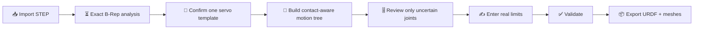

# 🦾 Windows STEP → URDF

[](https://github.com/IAMFanxy13/windows-step-to-urdf/actions/workflows/ci.yml)
[](LICENSE)
[](https://github.com/IAMFanxy13/windows-step-to-urdf/releases)

**Local-first, explainable STEP assembly → URDF conversion for Windows.** Import a robot assembly, let the software propose links and revolute joints, check movement visually, correct only the uncertain parts, fill real joint limits, then export URDF and meshes.

🇨🇳 [简体中文](README_zh-CN.md)


> [!IMPORTANT]
> This is a research-grade release candidate, not a one-click oracle. STEP usually preserves geometry and assembly instances but not the original CAD mate intent. Uncertain axes, motion sides, topology, mass data, and limits remain visible and reviewable instead of being silently accepted.

## ✨ What it does

- 📥 Reads STEP assemblies locally, with AP242 preferred.
- 🧩 Preserves XCAF definition/reference/occurrence structure and instance transforms.
- 🦾 Ranks possible actuator families using repeated geometry, weak name evidence, cylindrical features, local neighbourhoods, and fastener suppression—without a hard repetition threshold.
- ⭕ Stores a functional servo output port in the part's local frame, then maps it to every matching occurrence.
- 🕸️ Builds a contact graph from AABB screening plus exact B-Rep distance/contact evidence.
- 🌳 Proposes rigid groups and a single-root open-chain/tree topology, with cycle and multi-parent checks.
- 🎚️ Reviews each joint at `0° → +5° → -5°`, highlighting parent, child, descendants, axis, origin, and potential collision evidence.
- ✍️ Lets the user change the axis, origin, parent/child, motion side, direction, names, groups, and per-instance template exceptions.
- 🔒 Blocks formal export when required limits, valid geometry, tree structure, meshes, mass properties, or high-risk confirmations are missing.
- 📦 Exports URDF, visual/collision meshes, model metadata, and validation results.

## 🚀 Quick start on Windows

Prerequisites: **64-bit Windows**, **Node.js 24+**, **Python 3.13**, and Git.

```powershell
git clone https://github.com/IAMFanxy13/windows-step-to-urdf.git
cd windows-step-to-urdf
.\Start-STEP-to-URDF.cmd
```

That launcher is the one command needed after checkout. On first run it creates an isolated Python environment under `%LOCALAPPDATA%\STEPtoURDF`, installs locked web dependencies, starts a local service, and opens the browser. The application binds to `127.0.0.1` only.

Want to explore without CAD data? Click **🧪 Example**. The included two-joint AP242 file is generated specifically for this repository.

## 🧭 Workflow



The imported STEP pose is the URDF `q=0` pose. A servo template stores its output axis, interface centre, plane, normal, selected B-Rep entities, housing ports, and representative topology in local coordinates. Each occurrence receives a world-space port through its assembly transform; mirrored transforms are detected and handled with right-handed mesh variants.

See [Architecture](docs/ARCHITECTURE.md) for the data flow and [Research decisions](research/2026-08-product-and-open-source-research.md) for the sources behind it.

## 🧪 Development and verification

```powershell
npm ci
python -m pip install -r requirements-step.txt
npx playwright install chromium
npm run verify
```

`npm run verify` executes JavaScript domain tests, Python/OCCT geometry tests, a production build, four real-browser workflows, and the public-release privacy/secret/large-file gate.

## 📐 STEP guidance

- Export one complete assembly; AP242 is preferred.
- Keep assembly hierarchy and instance names when your CAD exporter supports them.
- Use a consistent unit system. Millimetre, metre, and inch import paths are regression-tested.
- Do not flatten the robot to one STL: exact faces, edges, topology, mass properties, and occurrence transforms would be lost.
- Treat every automatic joint as a candidate until the motion preview agrees with the mechanism.

## 🚧 Current boundaries

Supported: rigid open chains and trees with one revolute joint per servo/actuator interface.

Not supported: closed loops, parallel mechanisms, geared or linked motion, two actuators driving one joint, mimic joints, dynamics simulation, inverse kinematics, ROS runtime control, or real hardware control.

The source launcher is not yet a signed dependency-free Windows installer. Exact contact analysis and large assemblies can be computationally expensive. See [Roadmap](ROADMAP.md).

## 🔐 Privacy and security

The repository contains **no private robot model** and the application starts with an empty scene. Imported files and generated jobs stay on the local machine. Do not expose the localhost service to a network or upload confidential CAD in bug reports. Details: [Privacy](docs/PRIVACY.md) and [Security policy](SECURITY.md).

## 🙌 Contributing

Issues and pull requests are welcome. Please read [CONTRIBUTING.md](CONTRIBUTING.md), keep inference evidence explainable, and add a failing regression test before changing geometry or export behaviour.

## 📜 License and acknowledgements

Original project code is licensed under [Apache-2.0](LICENSE). Major foundations include Open CASCADE/OCP, Three.js, `urdf-loaders`, and `three-mesh-bvh`; their licenses and roles are recorded in [THIRD_PARTY_NOTICES.md](THIRD_PARTY_NOTICES.md).
