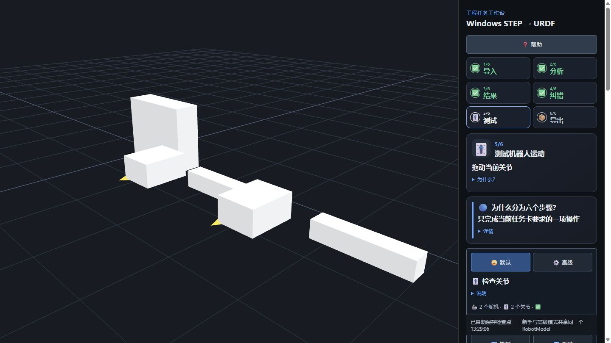

# 🦾 Windows STEP → URDF

[](https://github.com/IAMFanxy13/windows-step-to-urdf/actions/workflows/ci.yml)
[](LICENSE)
[](https://github.com/IAMFanxy13/windows-step-to-urdf/releases)

**一个本机运行、可解释、可人工纠错的 Windows STEP 装配体 → URDF 工具。** 导入完整机器人，软件先自动提出 Link、旋转关节、输出轴和运动侧；你用动画检查异常、填写真实限位，验证通过后再导出 URDF 与网格。

🌍 [English](README.md)



> [!IMPORTANT]
> 当前版本是研究型候选版本，不是假装永远正确的“一键转换器”。STEP 通常保留几何和装配实例，却不一定保留原 CAD 的配合意图。不确定的轴心、运动侧、拓扑、质量和限位会明确进入复核，而不是静默猜测。

## ✨ 已实现

- 📥 本机读取 STEP 装配体，优先 AP242。
- 🧩 保留 XCAF 的零件定义、引用、实例层级和装配变换。
- 🦾 综合重复几何、名称弱语义、圆柱特征、局部邻域和紧固件抑制排序疑似舵机，不用重复数量硬门槛。
- ⭕ 在舵机局部坐标系保存功能输出接口，再批量映射到同型实例。
- 🕸️ 先用包围盒粗筛，再用精确 B-Rep 距离与接触证据建立接触图。
- 🌳 自动提出刚性组和单根开链/树，并检查环路、孤立结构和多父节点。
- 🎚️ 每个关节按 `0° → +5° → -5°` 检查，同时高亮 Parent、Child、后代、轴线、原点和潜在碰撞。
- ✍️ 可以修改轴、原点、Parent/Child、运动侧、方向、名称、刚性组以及单实例例外。
- 🔒 限位、几何、树结构、网格、质量属性或高风险确认缺失时，禁止正式导出。
- 📦 输出 URDF、视觉/碰撞网格、模型元数据和验证结果。

## 🚀 Windows 快速启动

需要：**64 位 Windows**、**Node.js 24+**、**Python 3.13** 和 Git。

```powershell
git clone https://github.com/IAMFanxy13/windows-step-to-urdf.git
cd windows-step-to-urdf
.\Start-STEP-to-URDF.cmd
```

克隆后只需最后这一条启动命令。首次运行会在 `%LOCALAPPDATA%\STEPtoURDF` 创建独立 Python 环境、安装锁定的网页依赖、启动本机服务并打开浏览器。服务只监听 `127.0.0.1`。

没有 STEP 文件也可以先点 **🧪 示例**；仓库内置的是专门生成的两关节 AP242 公共样例。

## 🧭 使用流程


导入时的 STEP 姿态就是 URDF 的 `q=0`。舵机模板在局部坐标系保存输出轴、接口中心、平面、法向、选中的 B-Rep 实体、外壳安装面和代表实例拓扑；每个装配实例通过自己的变换得到世界轴线。软件会检测镜像变换，并通过右手网格变体避免把反射矩阵写进 URDF。

详细数据流见[架构说明](docs/ARCHITECTURE.md)，调研依据见[研究与工程决策](research/2026-08-product-and-open-source-research.md)。

## 🧪 开发与验证

```powershell
npm ci
python -m pip install -r requirements-step.txt
npx playwright install chromium
npm run verify
```

验证会运行 JavaScript 领域测试、Python/OCCT 几何测试、生产构建、4 条真实浏览器流程，以及公开发布的隐私、密钥和大文件门禁。

## 📐 STEP 导出建议

- 导出一个完整装配体，优先 AP242。
- CAD 导出器支持时保留装配层级和实例名称。
- 全模型使用一致单位；毫米、米和英寸路径均有回归测试。
- 不要先压成单一 STL，否则会丢失精确面、边、拓扑、质量和实例变换。
- 自动识别结果都是候选，必须以运动预览是否符合机械结构为准。

## 🚧 当前边界

支持：每个舵机/执行器接口对应一个旋转关节的刚性开链或树状机器人。

不支持：闭环、并联机构、齿轮或连杆联动、双执行器共同驱动、Mimic Joint、动力学、逆运动学、ROS 在线控制和真实硬件控制。

当前仍是源码启动方式，不是签名且免依赖的 Windows 安装包。精确接触分析在大型装配体上可能较慢。详见[路线图](ROADMAP.md)。

## 🔐 隐私与安全

公开仓库不包含任何私有机器人模型，应用启动时也是空场景。导入文件和生成任务都保存在本机。不要把本机服务暴露到网络，也不要在 Issue 中上传保密 CAD。详见[隐私说明](docs/PRIVACY.md)和[安全策略](SECURITY.md)。

## 🙌 参与开发

欢迎 Issue 与 Pull Request。请先阅读 [CONTRIBUTING.md](CONTRIBUTING.md)，保留推断依据，并在修改几何或导出行为前先增加一个会失败的回归测试。

## 📜 许可证与致谢

项目原创代码使用 [Apache-2.0](LICENSE)。主要基础包括 Open CASCADE/OCP、Three.js、`urdf-loaders` 和 `three-mesh-bvh`，具体许可证与用途见 [THIRD_PARTY_NOTICES.md](THIRD_PARTY_NOTICES.md)。
