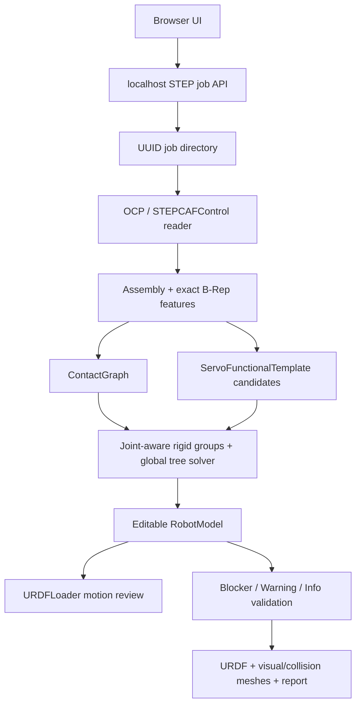

# Architecture

## Runtime boundary

The product is a local Vite/Three.js application backed by a localhost Node API and isolated Python/OCP workers. The browser never parses STEP itself. Each upload receives a UUID job directory, the original file is made read-only, and the worker writes JSON/STL artifacts consumed by the editor.

## Core data decisions

- `definition` is reusable STEP geometry; `occurrence` is an assembly instance with its own transform.
- Servo axes and interface centres are stored in definition-local coordinates, not copied world coordinates.
- Joint axis and joint origin are separate values. Cylindrical geometry can establish an axis line without proving the best interface centre.
- `ContactGraph` evidence is reusable by rigid grouping, fixed/output-side classification, parent/child inference, fastener suppression, and root recommendation.
- Rigid groups and joints are solved iteratively: initial grouping, protected rotation-edge cuts, regrouping, joint generation, and global topology checks.
- User edits are transactional and update the same `RobotModel` used by preview, validation, and export.
- Result provenance distinguishes automatic, template-derived, and user-confirmed values.

## Main modules

| Area | Files | Responsibility |
|---|---|---|
| STEP import | `scripts/occt_step.py`, `scripts/step_import_worker.py` | XCAF hierarchy, units, transforms, B-Rep, tessellation, mass properties |
| Candidate analysis | `scripts/candidate_engine.py` | evidence-ranked actuator and joint candidates |
| Contact/topology | `src/contact-graph*.mjs`, `src/global-kinematic-solver.mjs` | contact classification, rigid grouping, root/tree solution |
| Servo template | `src/servo-functional-template.mjs`, `src/servo-template-controller.mjs` | local output port, identity/output/topology gates, batch matching, instance overrides |
| Editable model | `src/robot-model.mjs`, `src/editor-store.mjs` | schema, validation, atomic merge/split/edit and undo/redo |
| Preview/review | `src/main.js`, `src/preview-adapter.mjs`, `src/joint-review-controller.mjs` | Three.js view, joint motion, highlights, review queue |
| Export | `src/urdf-serializer.mjs`, `scripts/package_step_job.py` | URDF, meshes, metadata, validation bundle |

## Scientific boundary

STEP geometry can support strong geometric candidates; it cannot recreate design intent that was never exported. Confidence is therefore evidence, not truth. Formal export remains blocked until high-risk ambiguity and required joint limits are resolved.
